# 为什么我们做的不是另一个低代码平台，而是 AI 时代的 AI 原生应用构建平台

很多企业软件团队,在今天都站在一个很微妙的分叉口。

一边,是过去十几年已经非常成熟的低代码路径。表单、流程、审批、门户、报表,这套体系已经帮助很多企业把大量业务流程搬到了线上。以公开产品定位来看,像云之家/宜搭这样的产品,本质上是在做低代码应用搭建平台;。它们解决的是一个非常重要的问题: 让企业更快把系统做出来。

但另一边,AI 开始进入企业一线。销售开始希望"直接说一句话就能建商机",主管开始希望"问一句哪些机会卡住了就能得到解释",运营开始希望"系统不仅告诉我规则没过,还告诉我为什么没过、影响了哪些对象、下一步该怎么做"。

这时候,我们会发现一个关键断层:

传统低代码平台很擅长把页面、表单、流程搭起来,却并不天然擅长把企业业务世界,组织成一套让 AI 可以真正理解、推理、执行、追溯的语义系统。

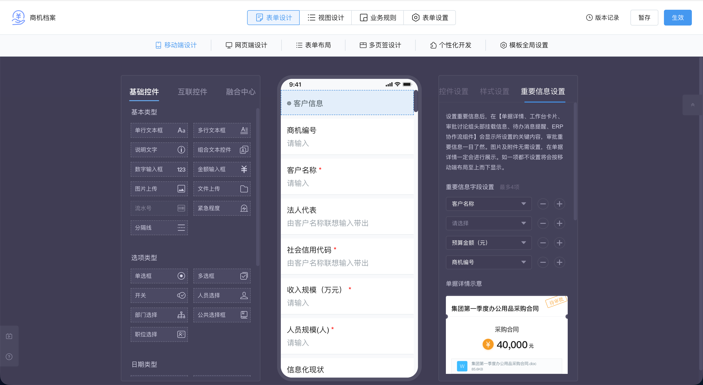

这正是我们为什么没有把这个项目简单定义成"再做一个低代码平台",而更愿意把它理解为: AI 时代的 AI 原生应用构建平台。

更准确地说,我们想解决的不是"如何更快搭一个应用",而是"如何先把业务世界定义清楚,再让 AI 和人一起在这个业务世界中工作"。

这类判断,其实也能从 Palantir Foundry / AIP 的 Ontology 思路里得到一些外部支撑。至少从相关材料看,Palantir 真正强调的重点也不是"再做一个图谱界面"或"再加一个 AI 助手",而是把业务对象、对象关系、可执行动作、运营应用和治理边界,放进同一套可操作的语义体系里。

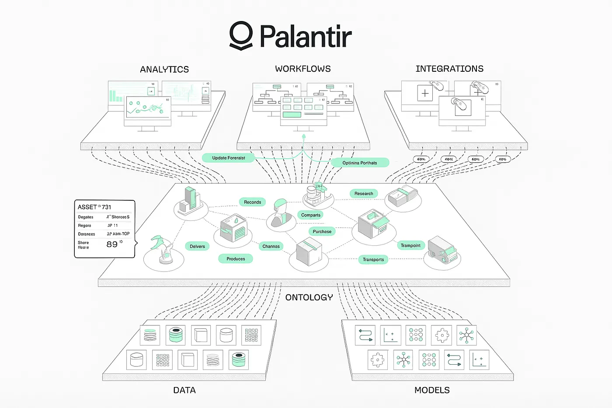

从这批场景材料里,我们越来越确认,这套系统真正围绕的是四个持续循环的业务问题:

- 如何接住一句话,把第一条业务数据自然地带进系统
- 如何托住一次推进,让系统在关键节点真正辅助打单
- 如何看见一个风险,让主管从结果管理走向过程干预
- 如何复用一份经验,让一次赢输单复盘变成组织资产

至少从目前的材料和场景推演来看,如果这四个问题没有被同时认真对待,系统再漂亮,也还是很容易退化成"表单系统 + AI 聊天框"。

可以用一段很短的结构化示意来理解这种差别:

```yaml
# 用户说的话
intent: "新增一个商机,客户是江苏某制造企业,预算50万"

# 系统真正需要落成的不是一句回复,而是一条业务动作链
resolve_to:
  object: Opportunity
  skill: Opportunity.Create
need_followup:
  - contact_name
  - current_system
after_save:
  - emit: opportunity.created
  - create_todo: demand_discovery
```

## 一、问题不是"能不能搭页面",而是"AI 能不能理解业务"

如果把企业系统看成一个静态录入器,那么传统低代码已经足够好。

但如果把企业系统看成一个由 AI 和人共同工作的业务环境,问题就完全变了。

以 CRM 为例,表面上看,它无非就是线索、客户、联系人、商机、报价、合同几张表。但项目里的 CRM 样板间一展开,复杂度马上就出来了。

线索不是录进去就结束,它要经历"新建、待补全、已判定、已转客户、已作废"的生命周期;商机不是改一个状态字段就结束,它要经过资格确认、需求确认、方案报价、商务谈判等阶段门槛;报价不是一张独立单据,它必须继承客户、联系人、产品、价格规则,并在审批通过后才能生成合同;合同也不是最终结果,它还必须保留从报价、商机一路向上追溯的来源关系。

这意味着,CRM 真正的核心从来不是页面,而是业务语义本身:

- 什么是对象
- 对象之间怎么关联
- 哪些动作允许做
- 哪些条件不满足就不能做
- 做完之后会触发什么事件
- 这些事件会把哪些对象推进到下一步

如果这些东西没有被显式表达,AI 就只能在页面字段和自然语言之间来回猜。它也许能"会说话",但并不真的"懂业务"。

这也是为什么很多系统接了 AI 以后,看起来很聪明,但一落到业务现场就容易失真。因为它能对话,却接不住业务意图;能生成文案,却推不动业务状态;能发出提醒,却说不清原因、责任和下一步动作。

如果借用一个相对粗糙但便于理解的说法,传统 CRM 更像 `System of Record`,擅长记录发生了什么;而我们正在尝试的方向,更接近 `System of Work`,甚至有机会进一步长成 `System of Intelligence`,不仅记录事实,也参与理解、解释、执行和复盘。

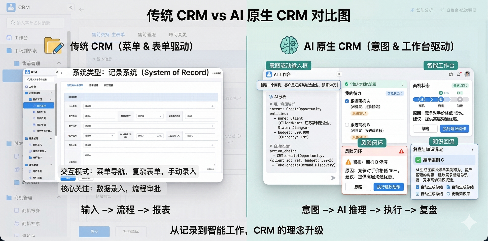

## 二、从 CRM 场景里,系统被一步一步"推导"出来了

这个项目最重要的地方,不是我们先画了一个五层架构,再去找场景塞进去;而是先把 CRM 前链路慢慢摊开,再发现它大概率需要一套分层更清楚的系统结构。

从"线索到合同"的链路往下拆,我们当前更倾向把它理解成四层业务架构加一个智能底座。这不是说只有这一种分法,更不是技术部署上的绝对真理,而是一种从业务架构视角出发、目前相对自洽的工作性抽象。

材料里反复提醒我们,关键其实不在"分了几层",而在于边界是否清楚、每一层到底回答什么问题。按我们现在的理解,这四层加底座大致对应这样几类责任:

- 本体层回答"业务世界由什么组成、允许什么、约束什么"
- 技能层回答"这些语义如何变成可执行能力"
- 场景层回答"这些能力如何围绕业务目标被组织成一套工作方式"
- 交互层回答"人如何自然进入这些场景并持续工作"
- 智能底座回答"如何统一支撑交互与执行所需的智能能力"

这套架构最重要的调整是把智能能力从业务层剥离,下沉为底座。客户买的是业务场景,实施顾问配置的是场景包,底层智能能力则由平台统一承接。

如果把这种责任链用一张极简架构图表示,大概是这样:

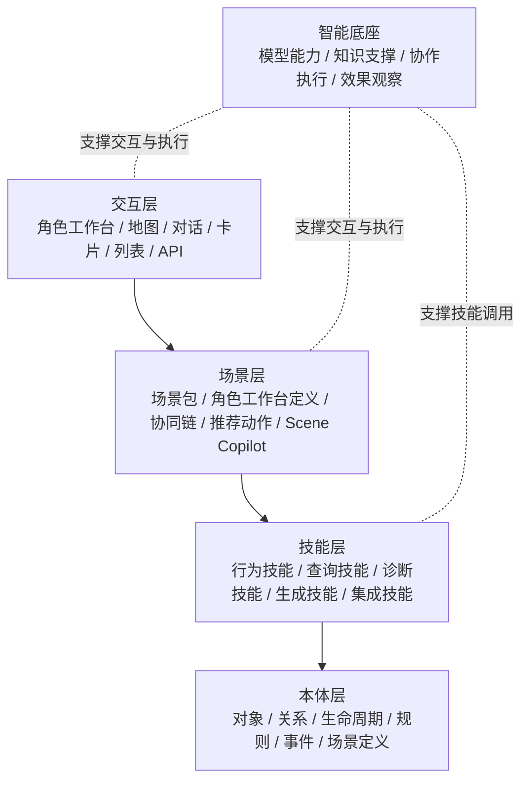

这张图想表达的核心非常朴素:

- 四层是业务架构,智能底座是统一支撑
- 本体层是控制面,技能层是执行面,场景层是交付面,交互层是入口面
- AI 并不是悬在最上面的"万能外挂",而是沉到底座,在语义和动作边界内受控执行

**对外只讲四层业务架构;智能能力不再被当作业务层,而是统一沉到底座。**

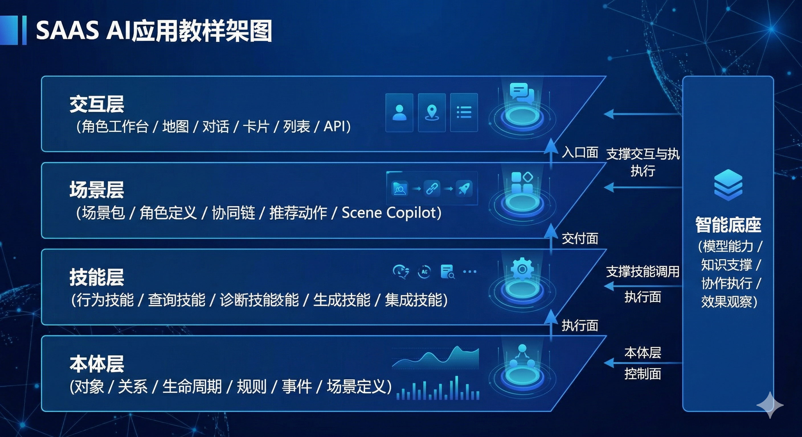

但如果只写到这里,这种分层还是有点像抽象说明。更贴近真实情况的方式,可能还是回到阿宇和张总的一天,看看系统到底是在什么地方被业务一步步"逼"出来的。

先看阿宇。

阿宇刚拜访完客户,走在去地铁站的路上,脑子里还热着,就顺口对系统说一句: "新增一个商机,客户是江苏某制造企业,预算 50 万,目前刚接触。"

这句话听起来很简单,但只要稍微认真一点,就会发现它背后已经提出了一连串问题。

系统怎么知道这是"创建商机"的意图,而不是"查询商机"或"补充客户信息"?

系统怎么知道应该先创建哪些对象,是只建一个商机,还是连客户草稿、联系人草稿一起建?

系统怎么知道哪些信息可以后补,哪些信息至少现在就得问?比如商机名称、关键联系人、当前系统、负责人,到底哪些算最小建档条件?

系统又怎么把"已接住、但还不完整"的状态,继续变成可追问、可回写、可推进的业务档案?

只要把这一个小场景拆开,很多东西其实就自然浮出来了。至少要有一套对象和规则,系统才知道"商机""客户""联系人"分别是什么;至少要有一套能执行创建草稿、补全信息、回写状态的技能,系统才不至于停留在"我听懂了";而要把一句口语化输入稳定翻译成"创建草稿 -> 校验最小条件 -> 继续追问 -> 形成下一步待办"这一连串动作,中间就需要一个场景包来装配意图识别、技能调用、规则检查和后续动作。

换句话说,阿宇不是在"用一个聊天框",他更像是在向一个懂业务的助理报备。而一旦系统真的要接住这种报备,分层结构就不是为了好看,而是为了避免把语义理解、业务规则、动作执行全都糊在一起。场景层负责把这些技能和规则装配成一套真正可交付的工作方式。

```yaml
# "一句话建档"背后真正要落下来的动作契约
skill: Opportunity.Create
inputs:
  - customerName
  - amount
  - stage
rules:
  - Opportunity.MinimumCreateInfo
writeback:
  - Customer
  - Opportunity
```

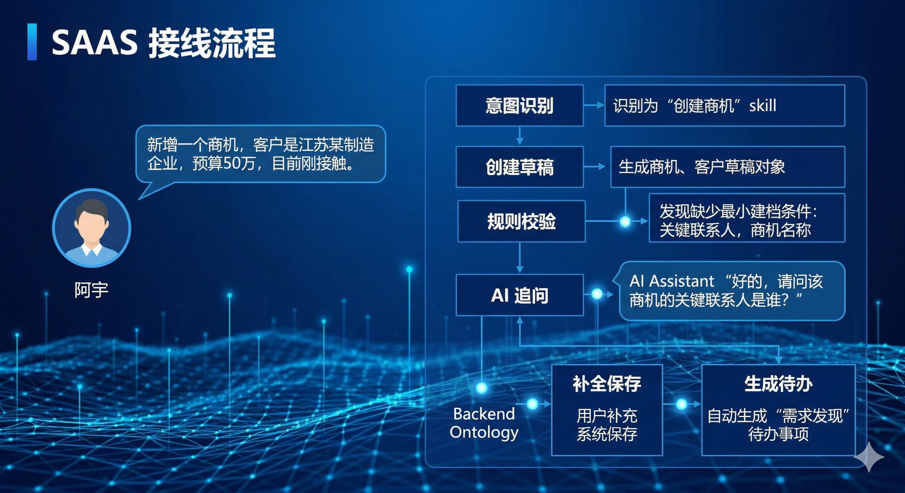

再看阿宇的第二类场景。

当他准备汇报方案,或者被客户当场质疑"价格太高"时,他对系统说的已经不再只是"帮我建一条记录",而是"帮我分析这个客户的信息化现状""客户说价格太高,我该怎么应对"。这时候,系统如果只是一个通用大模型助手,当然也能吐出一段像样的话术;但如果要真正对业务有帮助,它还得知道当前面对的是哪个客户、哪个商机、处于什么阶段、竞争对手是谁、预算状态如何、历史上有没有相似案例。

到这里,问题又变了。系统已经不只是需要"能回答",还要能带着当前业务上下文回答;不仅要能说出建议,还最好能把建议落回具体对象和下一步动作上。于是,"当前在处理哪个对象""哪些规则此刻适用""推荐动作是否真的允许执行"这些事情,就不再是可有可无的锦上添花,而是系统能否可靠工作的前提。场景层在这里负责装配客户画像、竞品策略、话术模板和推荐动作,让 AI 副驾能够围绕当前上下文运转。

第三类场景更能把平台结构逼出来。

阿宇说一句: "帮我向售前团队申请一下江苏那个制造客户的技术方案支持,下周三要。"

这里已经不是简单问答,而是一次跨角色、跨对象、跨动作的协同请求。系统需要先知道"江苏那个制造客户"指的是哪个机会,再抓取已经沉淀的客户需求和上下文,生成售前支持请求,通知对应负责人,并在进度到 50% 或完成时同步给阿宇。

如果没有统一的业务对象和关系,系统很难知道"那个客户"到底是谁;如果没有显式技能与接口,它很难把一句话稳定变成可追踪的协同请求;如果没有事件与回写机制,它又很难在进度变化时把消息回推给正确的人。到这一步,我们基本就能理解,为什么材料里会不断强调这类系统不是"表单系统 + AI",而更像一个围绕对象、技能、事件和角色协同展开的工作系统。场景层在这里负责装配协同入口、SLA、升级路径和角色通知机制。

```yaml
skill: PresalesSupport.Request
target_object: Opportunity
preconditions:
  - opportunity.exists
  - owner.assigned
emits:
  - presales.requested
writeback:
  - PresalesRequest
  - Activity
```

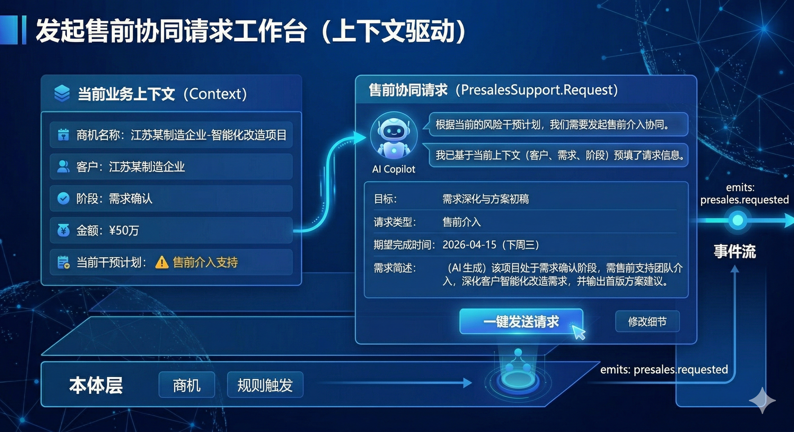

最后再看张总。

张总最典型的场景,不是自己录数据,而是早会前问一句: "查看高风险商机。"或者更常见的,是他根本还没开口,系统已经因为"7 天未联系""阶段停留过久""关键动作缺失"而发出升级预警。

这类场景特别能说明问题。因为这里最关键的不是"看见了一张报表",而是系统要先判断什么叫风险、什么时候提醒一线、什么时候升级给主管、升级之后应该附带哪条原因链、哪几个建议动作、由谁来介入。也就是说,风险不是一个图表栏目,而是一个被规则、事件、对象状态和责任角色共同定义出来的业务判断。场景层在这里负责配置风险口径、默认面板、诊断技能和干预动作模板。

再往前走半步,张总介入之后,系统最好还要把这次介入变成行动项和结果回写。否则就还是停留在"通知系统",而没有真正形成经营闭环。也正因为如此,材料里才会一再强调,预警真正的价值不在"发现异常",而在能否把异常变成可执行的干预动作,并知道什么时候该升级给谁。

```yaml
rule: Opportunity.StalledEscalation
when:
  - days_in_stage > standard_days * 1.5
then:
  - notify: sales_owner
  - escalate_to: manager
  - create_action_item: intervention_plan
```

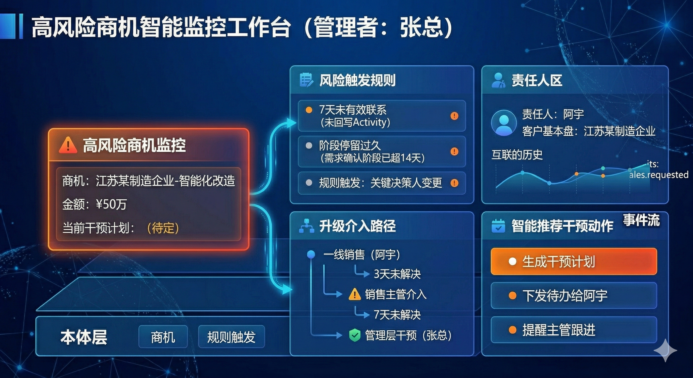

还有一类场景,往往只有做到后面大家才会意识到它的重要。

比如季度末,阿宇赢下了一个百万级项目,但也输掉了另一个跟了半年多的重点客户。张总这时候最想知道的,往往不是"结果是什么",而是"到底为什么会赢、为什么会输,这些经验能不能下次继续用"。

如果系统只是记录了一个"已赢单"或"已输单"的状态,那复盘最后还是会回到主观印象: 赢了归功于个人能力,输了归因于价格、产品或者运气。这样的 CRM 能留痕,却很难真正沉淀组织能力。

但如果系统已经把这个项目周期里的聊天记录、邮件往来、方案版本、报价变更、阶段停留、竞争对手信息、主管介入动作都串在一起,那复盘就会变成另一种东西。它不再只是一次会议,而更像一次结构化分析: 赢单的关键因素是什么,输单的主要断点在哪里,哪些判断是主观的,哪些证据是客观的,哪些打法值得沉淀成可复用资产。

再往前走一步,这些资产如果还能被重新打上行业、规模、竞品、阶段等标签,并在下一次出现相似机会时自动回流给阿宇,那系统就已经不只是帮助"这一次销售",而是开始帮助"下一次销售"。从这个角度看,知识飞轮也不是附加模块,而是业务平台逐步成熟后很自然会长出来的一层价值。

```yaml
asset: WinLossReview
tags:
  - industry: manufacturing
  - competitor: xx_erp
  - stage: negotiation
reuse:
  - recommend_to_similar_opportunities
  - feed_manager_playbook
```

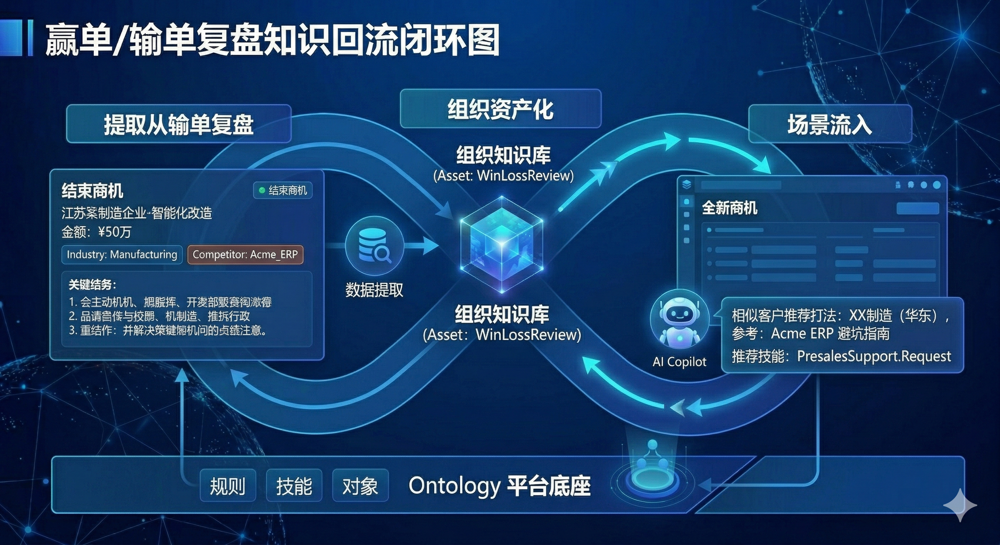

如果把阿宇和张总这几类时刻放在一起看,会更容易理解我们的分层为什么是从场景里长出来的,而不是从技术名词里长出来的。

阿宇的一句话建档,逼出了意图识别、对象定义、最小规则和技能调用。

阿宇的打单支持和售前协同,逼出了上下文装配、角色协作、技能调用和事件通知。

张总的风险干预,逼出了规则中心、事件轨迹、升级链和行动回写。

赢单或输单之后的复盘与经验回流,又进一步提醒我们,平台最终恐怕还不能只停在"建模 + 执行"这一步,而是还要继续长出事实记忆、知识沉淀和组织学习能力。

所以更准确地说,CRM 场景并没有"证明世界上只有四层"。它只是很诚实地把问题一层层摊开,让我们看到: 如果既不想退回表单流程思路,也不想停留在一个泛化聊天助手上,那系统大概就会朝这样一种更清楚的分层结构演化。

如果借用 Palantir 式平台给人的一个启发,那就是: 真正有价值的分层,不是为了把代码摆整齐,而是为了让"语义定义、技能执行、场景装配、交互呈现"这几件事各自有稳定边界。也正因为如此,我们更愿意把这里的分层理解成业务责任分层,而不是技术部署分层。

### 1. 本体层:定义业务世界

原因很简单: 无论后面怎么扩,首先总得先回答"这个业务世界是什么"。

线索、客户、联系人、商机、产品、报价、合同、销售人员、组织、活动,这些对象的定义、属性、关系、生命周期,至少需要先有一套相对统一的表达。否则不同页面、不同角色、不同场景看到的都还是各自理解下的 CRM。

本体层是整个平台的语义控制面,它定义业务真相与边界,但不直接承担业务执行与交互。

### 2. 技能层:沉淀执行能力

仅有对象显然还不够,系统还需要知道"它们能做什么"。

比如录入线索、补全线索、线索转商机、推进商机阶段、生成报价、提交审批、批准报价、生成合同,这些更适合被理解成行为技能。技能层把本体里定义的行为,逐步落实为真正可执行的受控动作与查询能力。

技能层是执行原语层,它不是控制面,也不是用户界面,而是把业务语义转成可复用、可治理、可追溯的执行能力。

### 3. 场景层:装配业务场景

这是平台最关键的交付层。一个复杂业务目标,往往不是单个技能就能完整收掉的。

销售说"帮我把这个客户机会推进到可报价状态",背后往往是一串技能调用、规则检查、对象补全、状态判断。场景层负责把这些技能、规则、角色工作台、推荐动作和 AI 副驾装配成一套真正可交付的工作方式。

场景层用业务目标组织技能、规则、角色工作台与 AI 副驾,形成真正可交付的场景包和运行机制。

### 4. 交互层:进入业务现场

当下面几层有了基本雏形之后,自然语言才更有可能成为可靠的业务入口。

交互层通过角色工作台、地图、对话、卡片、列表和详情抽屉,把系统自然暴露给销售、主管、总经理和运营。它负责业务入口与呈现,不定义业务规则,也不直接决定执行边界。

### 5. 智能底座:统一支撑

智能能力不再被当作业务层,而是统一沉到底座。底座负责提供统一的模型能力、知识支撑、协作执行和效果观察,服务于四层,而不是替代四层。

**这是这次架构调整最重要的部分。** 客户买的是业务场景,实施顾问配置的是场景包,底层智能能力则由平台统一承接。

智能底座主要承担以下几类责任:

- **统一智能能力**: 统一承接底层模型能力,让上层场景不用关心底层差异
- **协作执行能力**: 支撑对话、副驾和任务执行,让 AI 能稳定参与业务协作
- **知识与上下文**: 为场景提供所需资料、历史与当前语境,让输出更贴近业务现场
- **规则与边界**: 统一约束输出方式、动作边界和使用规范,避免每个场景各自维护
- **观察与优化**: 持续观察效果、复盘问题、优化体验,让平台越用越稳

更合理的说法是: **四层是业务架构,智能底座是统一支撑。** 这样客户能听懂,实施能落地,平台也能持续升级而不破坏上层业务结构。

- **对客户更清楚**: 客户看到的是场景、工作台、地图和行动闭环,而不是底层智能细节
- **对实施更现实**: 实施顾问配置的是规则、技能、场景和工作台,而不是管理复杂的技术组件
- **对研发更解耦**: 底座能力可以独立升级,而不频繁重构业务层定义

不过如果只把"交互层"理解成一个聊天窗口,其实已经有点落后了。过去一年里,外部产品的演化给了我们两个很强的信号。

第一个信号是"无头表格"正在重新变重要。像 TanStack Table 这类官方文档明确强调自己是 headless table,也就是表格本身不再强绑定某种固定 UI,而是把排序、过滤、分组、选择、列配置这些能力抽出来,交给上层自由组合。放到 AI 原生应用里,这件事的意义非常大: 交互层终于不必停留在"给你一段自然语言答复",而可以把答复直接投影成一个可继续操作的对象列表、风险清单或商机工作面。

比如张总说一句"把近 7 天没跟进且金额大于 50 万的商机筛出来",系统最自然的落点,未必是一段回答文字,而更可能是一张已经带好筛选条件、分组状态和推荐动作的无头表格。接下来,张总可以继续说"按区域分组""把华东区单独拉出来""只保留需要主管介入的",而 AI 实际上是在操作同一个对象视图,而不是一次次重写答案。

第二个信号是"Canvas / Artifacts / Mini App"正在变成交互层的重要补充。Google 在 2025 年 3 月 18 日推出 Gemini Canvas,把它定义成一个可创建、编辑、预览和分享文档或代码的交互空间;随后在 2025 年 5 月 6 日又强调 Gemini 2.5 Pro 已经可以在 Canvas 里通过单个提示构建交互式 web app。OpenAI 的 Canvas 近来的官方说明里,也已经明确支持 React/HTML 渲染 mini apps,并允许在沙箱环境中预览和分享。

这些变化指向的是同一个趋势: 交互层正在从"纯文本对话"升级成"对话 + 工作表面"。用户说一句话之后,系统不一定只回一句话,它还可以顺手长出一个轻量 React 面板、一个风险干预画布、一个报价模拟器、一个客户分析小应用,供人继续点、改、看、确认。

但这里有一个边界非常重要。我们说的 Canvas,并不是让模型随便生成一个小应用就替代正式系统,而是让它在受控范围内生成一个"临时工作表面"。这个表面背后仍然应该绑定清晰的对象、行为、规则和动作接口。也就是说,Canvas 可以更灵活,但它不能成为新的真相源。

如果把今天更完整的交互层画出来,它可能更像这样:

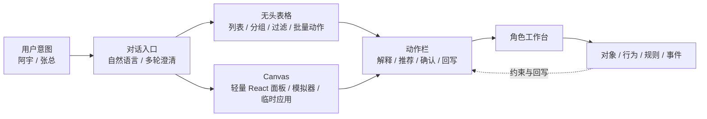

这张图想表达的重点是:

- 交互层仍然是入口,但不再只有一种界面形态
- 无头表格适合承接"对象集合"的操作
- Canvas 适合承接"临时应用"和"场景画布"
- 最终所有这些交互都还是要回到对象、行为、规则和事件的约束链上

如果写成一段极简伪代码,大概会像这样:

```ts
interactionSurface = {
  chat: true,
  table: {
    type: "headless",
    bindObject: "Opportunity",
    aiControls: ["filter", "sort", "group", "select", "triggerAction"],
  },
  canvas: {
    type: "react-mini-app",
    bindScenario: "risk_intervention",
    allowedActions: ["assign_owner", "create_todo", "escalate"],
  },
}
```

所以,交互层如果要跟上最新一轮产品趋势,它更像是一个"多表面的交互层",而不是一个单一聊天框。聊天只负责接住意图;真正把意图变成业务动作的,是后面这些可视、可改、可确认、可回写的工作表面。

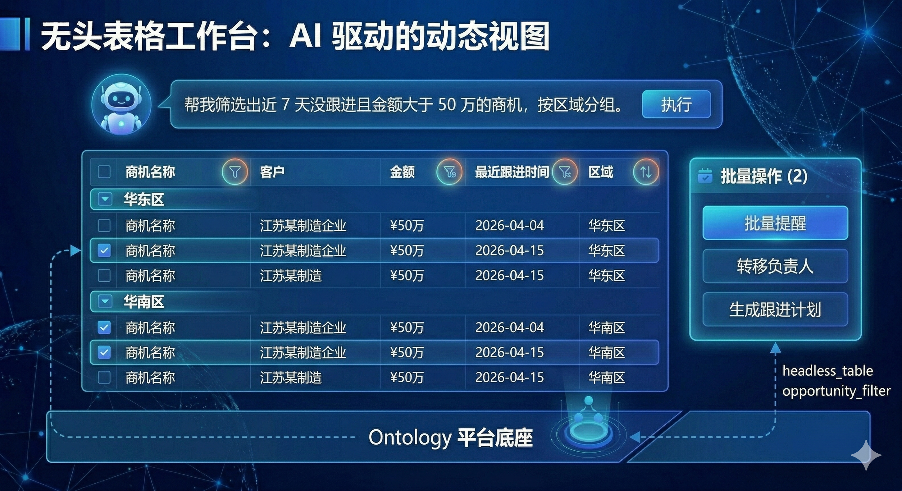
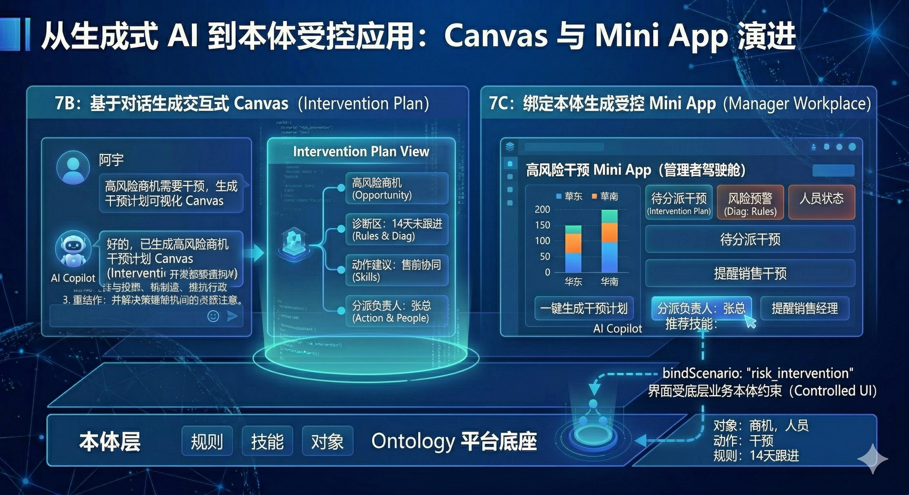

## 三、它和传统低代码真正的区别,不在"有没有 AI",而在"控制面在哪里"

很多人会把"低代码+AI"与"AI 原生应用平台"混为一谈,但两者最根本的区别,其实是控制面的不同。

传统低代码的控制面,通常落在表单、流程、页面、审批配置上。你改变业务,主要是在改页面结构、流程节点和字段权限。

而我们这套系统目前更想把控制面落在对象、技能、场景、交互上。也就是说,业务变化首先反映为语义和执行规则的变化,然后才是页面与工作台的变化。

这也是我们从 Palantir 身上真正借鉴的一点。更像 Palantir 的地方,从来不是界面长得像不像,而是它把 `Ontology` 当成语义控制面,把 `Action Type` 之类的可执行动作当成操作通道,再让 `Workshop / Operational App` 这一类前台应用去消费这些语义资产,而不是反过来由页面结构决定业务模型。

如果把这个差别写成一个极简对照,大概会像下面这样:

```yaml
# 传统低代码更像
page: opportunity_form
workflow: quote_approval_flow
fields: [customer, amount, owner, stage]

# 语义驱动平台更像
object: Opportunity
skill: Opportunity.GenerateQuote
rules:
  - Quote.GenerationEligibility
  - Quote.MarginGuard
event: quote.generated
scenario: SalesWorkbench
```

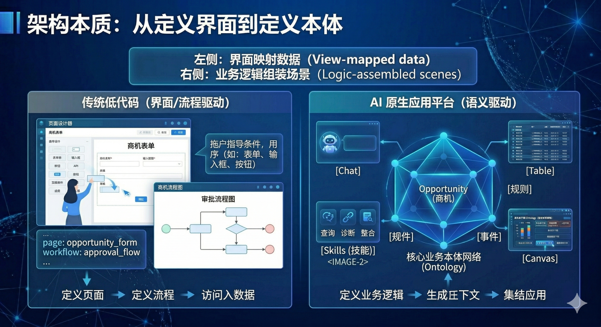

这会带来几个本质区别。

第一,传统低代码更关注"系统怎么搭出来",我们更关注"业务世界怎么被准确定义出来"。

第二,传统低代码里的 AI 往往是助手角色,帮助填表、生成文案、做问答;我们的 AI 是下沉到底座的智能能力,服务于场景,但它不能绕开底层本体和规则乱做决定。

第三,传统低代码的复用单位通常是页面模板、流程模板、组件模板;我们的复用单位是场景包、技能包和本体资产,也就是对象模型、规则包、事件链和场景装配方式。

第四,传统低代码的追溯更多是操作日志级别;我们追溯的是"哪个对象触发了哪个技能,命中了哪些规则,发出了什么事件,最终影响了哪些业务对象"。

第五,传统低代码的主目标通常是交付速度和装配效率;而我们现在更关心的,已经开始偏向经营质量和组织智能沉淀。也就是说,低代码在这里仍然重要,但更像底座,而不是终点。

所以如果把当前的判断再压缩一下,大概会落到这样几句话上。

第一,低代码更像底座,不太像终点。

第二,至少在 ToB 复杂场景里,语义往往比页面更值得优先稳定下来。

第三,AI 更适合下沉到底座,成为统一支撑能力,而不适合直接充当业务层或真相源。

第四,技能与 API 如果能尽量同源,动作语义会更一致。

第五,预警如果迟迟走不到行动闭环,最后大概率仍然只是一个更华丽的通知系统。

从 blog 里的 Palantir 资料看,这种"预警必须连到动作"的意识也很强。它们会特别强调 `Action` 才是把图谱从"只读认知层"变成"可操作平台"的关键,而 LLM 或智能能力本身不能越过这些预定义动作直接乱改系统。这个约束思路,对我们现在做企业级 AI 原生应用平台也很有参考价值。

所以这不是在否定传统低代码。恰恰相反,我们认为它非常有价值,只是它解决的是"更快构建业务应用"的问题;而我们这套系统解决的是"如何让 AI 在企业业务里可理解、可执行、可治理、可追溯"的问题。

目标函数不同,系统形态大概率也会随之不同。

换句话说,至少在我们当前的理解里,最大的不同还不是"有没有 AI",而是 AI、语义控制和事实记忆,是否已经逐渐进入平台主干组件。

## 四、为什么第一站是 CRM,而不是更抽象地谈平台

因为 CRM 是一个非常适合把问题暴露出来的样板领域。

它足够通用,几乎所有企业都能理解;它又足够复杂,不是几张表就能说清。它同时包含对象关系、生命周期推进、多角色协同、规则门槛、审批约束、来源继承、全链追溯等问题。

如果一套平台只能把 CRM 做成"可录入、可审批、可查询",那它仍然停留在传统企业软件思路里。

但如果一套平台能够做到:

- 销售通过自然语言录入线索和商机
- AI 主动追问缺失信息
- 商机阶段推进时自动解释为什么能推进、为什么不能推进
- 报价与合同始终保持来源继承和追溯
- 主管看到的不是一张静态报表,而是一条风险链、一组阻塞原因和可执行动作

那它至少说明,这个平台已经不只是"在搭一个 CRM",而是在尝试验证一套新的应用构建范式。

这也是为什么我们把 AI 原生低代码在 V1 阶段定义为"样板应用工厂",而不是直接做一个大而全的通用平台。先用 CRM 把方法论跑通,比先讲一个无限大的平台故事更重要。

而且 CRM 天然能把那四个核心闭环都暴露出来。

销售要不要愿意开口说第一句话,对应的是意图接入闭环。

商机能不能被持续推进,对应的是过程推进闭环。

主管能不能在风险还没爆炸前介入,对应的是管理干预闭环。

赢单和输单的经验能不能自动回流到下一次机会里,对应的是知识飞轮闭环。

也正因为如此,CRM 特别适合作为第一块样板间。它不是为了证明"我们也能做一个 CRM",而更像是在验证"这套平台是否有机会让系统从记录业务,逐步进化为参与业务"。

## 五、这套平台最终想建立的,不是工具,而是企业级语义基础设施

真正有价值的地方,从来不只是"把 CRM 做出来"。

真正有价值的是,如果 CRM 这套本体、技能、场景、交互的方法论能够先跑通,它就有机会被复制到供应链、项目管理、合同管理、售后服务、渠道运营等更多领域。

也就是说,我们不是在不断复制页面,而是在不断沉淀可复用的业务语义资产和场景包。

借用"核心思想"那份材料里的表达,我们最终想推动的,也不是把平台从一个"可配置应用系统"小修小补地升级一下,而是希望它慢慢走向一种更完整的经营基础设施: 可定义业务世界、可组织业务运行、可持续沉淀组织智能。

这一点同样能从 Palantir 相关材料里得到侧面印证。它真正被反复强调的,也不是存储或 ETL 本身,而是语义层和决策层的差异化价值: 数据可以来自现有中台,页面也可以不断变化,但如果对象、技能、场景和治理边界能被稳定建模,平台就有机会从"应用集合"慢慢长成"业务操作体系"。

这些资产一旦可复用,组织就会形成真正的飞轮:

- 一线动作沉淀为事实和轨迹
- 事实和轨迹被解释成规则、案例和经验
- 规则和经验被封装成技能包和场景模板
- 技能和场景反过来进入下一次业务执行
- 下一次执行又继续产生新的组织资产

这时候,软件不再只是承载流程,它开始承载组织学习。

这也是 AI 时代企业软件最大的变化:

过去的软件资产,主要是代码、表单、流程和报表。

未来的软件资产,会越来越多地变成本体模型、技能体系、场景包、交互配置和智能底座能力。

谁如果能较早把这套基础设施搭起来,谁就更有可能在 AI 原生应用时代积累起真正的"底座能力"。

## 结语

所以,为什么要做这个系统?

因为我们越来越倾向于认为,AI 进入企业,带来的很可能不只是一个更聪明的聊天框。它可能会推动企业软件从"界面驱动"逐步走向"语义驱动",从"人适应系统"逐步走向"系统理解业务与人的意图",从"功能堆叠"慢慢走向"本体、技能、场景、交互的统一表达"。

从这个意义上说,我们做的不是一个传统低代码平台的升级版。

我们正在尝试的,是一套让 AI 能更真实地进入企业业务现场的应用构建平台。

它以本体定义业务世界,以技能沉淀执行能力,以场景组织业务运行,以交互承接人机协作,并由智能底座提供统一支撑。

它要接住一句话,托住一次推进,看见一个风险,复用一份经验。

而 CRM,不过是这套平台长出来的第一块样板间。