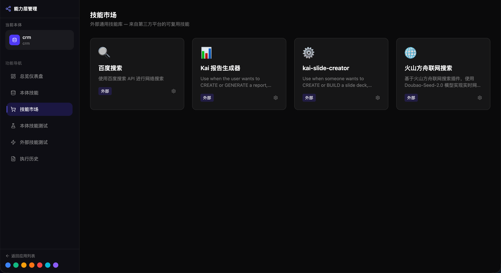
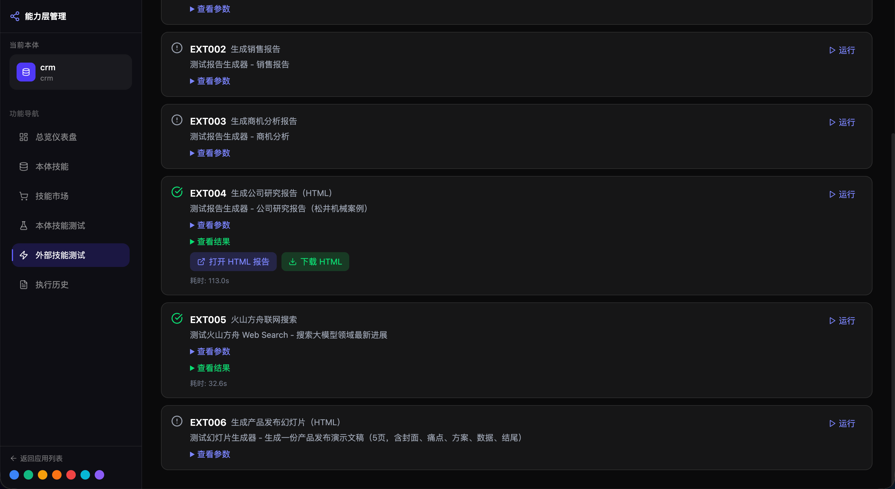
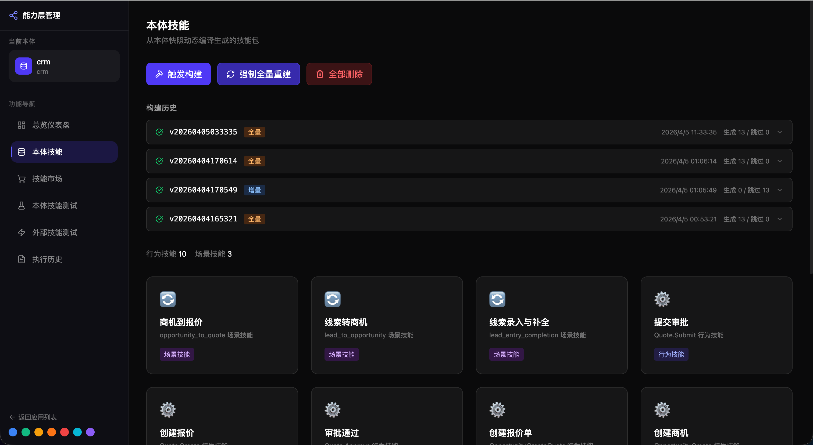

# 技能层（Skill Layer）思考笔记

> 记录对技能层设计的思考与疑问，作为后续研究和实现的参考。

---

## 一、定位：四层业务架构的执行面

技能层在**四层业务架构**中处于第二层，核心使命是将本体层定义的"业务世界是什么"转化为"业务世界能做什么"：

```
本体层（定义）──→ 技能层（执行）──→ 场景层（装配）──→ 交互层（入口）
  对象/规则/生命周期    受控动作体系    业务场景包    角色工作台
```

这个定位是清晰的：本体层是**控制面**，技能层是**执行面**，场景层是**交付面**，交互层是**入口面**。智能底座统一支撑四层，但不替代四层。

---

## 二、两类技能，两种成熟度

技能层同时承载两类性质截然不同的技能：

| 维度 | 本体技能（Ontology Skill） | 外部技能（External Skill） |
|------|--------------------------|--------------------------|
| 来源 | 从本体定义自动编译生成 | 手工编写、预置安装 |
| 与业务的关系 | 强绑定——每个行为对应一个技能 | 通用能力，与具体业务无关 |
| 运行时依赖 | 三库（MongoDB + Neo4j + ChromaDB） | 外部 API 或脚本调用 |
| 成熟度 | **待研究，疑问较多** | **相对清晰** |

---

## 三、外部技能：相对清晰

外部技能的本质是**对通用能力的标准化封装**——搜索、PPT 生成、报告生成等。这部分之所以清晰，是因为它遵循一个简单且成熟的模式：

```
输入参数（JSON）──→ 调用外部服务/API ──→ 返回结构化结果
```

**已经跑通的模式**：
- 每个外部技能一个独立目录 `skills/external/<skill_slug>/`
- 通过 `SKILL.md` 声明触发条件和使用说明
- `manifest.yaml` 描述技能元信息
- `scripts/execute.js` 作为统一执行入口
- 平台负责发现、加载、调度，技能自身只关心执行逻辑

**设计上没有大的困惑**。外部技能的边界是清楚的：它是"技能层对外部工具的适配层"，不涉及业务逻辑编译，不需要理解本体定义。




---

## 四、本体技能：核心困惑所在

本体技能是技能层最有价值也最不确定的部分。**它的核心命题是：如何从一份本体定义自动编译出可执行的技能包？**

### 4.1 已经想清楚的部分

1. **编译输入**：`Definition Snapshot`（定义快照）——从本体数据库真源读取，规范化、可哈希、可冻结
2. **参与策略**：
   - `Object` → 不生成独立技能，但提供字段定义和关系映射
   - `Behavior` → 每个行为生成一个 `Behavior SKILL`
   - `Scenario` → 每个场景生成一个 `Scenario SKILL`（确定性编排）
   - `Rule` / `Event` → 编译为绑定，嵌入行为技能的 manifest 中
3. **技能包结构**：`SKILL.md` + `manifest.yaml` + `manifest.json` + `scripts/execute.js` + `references/` + `evals/`
4. **三库写入策略**：MongoDB 主事实 + Neo4j 图投影 + ChromaDB 语义投影
5. **一致性模型**：同步写入，Mongo 为基准，Neo4j/Chroma 为投影

### 4.2 尚未想清楚的部分（待研究）

**问题一：编译的"智能"边界在哪？**

本体定义给出的是结构化元数据（字段名、类型、规则表达式、事件订阅关系），但技能执行需要的是具体的运行时逻辑。比如：
- `Lead.ConvertToOpportunity` 的写库计划需要知道"创建 Opportunity 的同时要建 Neo4j 的 CONVERTED_TO 边"——这从本体定义能**推断**出来吗？还是需要额外的人工标注？
- 规则表达式（如 `budget >= 10000`）的运行时求值器，应该编译成代码还是解释执行？

当前倾向：编译器做**结构映射**（哪些对象、哪些字段、写入哪些库），运行时做**逻辑求值**（规则校验、条件判断）。但这条线的精确分界还没定。

**问题二：write_plan DSL 的生成粒度**

当前设计了 MongoDB / Neo4j / Chroma 三套写库 DSL，但自动生成 write_plan 时：
- 对于简单的 CRUD 行为（如 `Lead.Create`），生成逻辑是机械的——对象字段 → MongoDB 文档 + Neo4j 节点
- 对于带副作用的行为（如 `Lead.ConvertToOpportunity` 同时创建 Opportunity + Customer + Contact），编译器如何知道要同时写多个对象？

可能的方向：
- 从本体 `postconditions` / `side_effects` 字段推断
- 从对象关系（`relations`）推断边的建立
- 但这些推断规则本身也需要一套元规则来定义——**谁来定义编译器的规则？**

**问题三：技能与场景层的职责分界**

在四层架构中，技能层提供原子执行能力，场景层负责装配和运行机制。但现实业务中存在大量需要判断的情况：
- 线索评估时，"是否值得跟进"的标准可能不是纯规则能表达的
- 报价审批时，50 万以上需要人工审批——但"审批"这个动作在技能层面怎么处理？

当前假设：技能层只提供原子能力，判断逻辑由场景层负责。但这个分界是否合理，还需要在实现中验证。

**问题四：本体演进时的技能兼容性**

本体定义会变化（加字段、改规则、调生命周期），变化后技能包如何处理？
- 增量编译的精确语义是什么？
- 旧的技能实例数据是否需要迁移？
- snapshot_hash 变了就重新生成——但"重新生成"是否意味着旧数据不兼容？

这些问题的答案会影响编译器的设计，目前还没有明确结论。

<!-- 图占位符：本体技能架构图 -->


---

## 五、技能层与场景层的关系

场景层是技能层的下一层，负责"把技能装配成可交付的业务场景包"。两者的边界：

| 维度 | 技能层 | 场景层 |
|------|-------|--------|
| 职责 | 提供可执行的原语能力 | 组织技能、规则、角色工作台、AI 副驾形成运行机制 |
| 交付物 | 行为技能、查询技能、诊断技能 | 场景包（如"客户洞察与话术辅助"、"团队经营洞察"） |
| 抽象级别 | 原子动作 | 业务目标驱动的动作组合 |
| 与 AI 的关系 | 可被 AI 调用，但自身不含 AI | Scene Copilot、推荐动作、自动化边界 |

**关键判断**：
> 技能层是执行面，场景层是交付面。客户买到的是场景包，不是技能清单。技能层为场景层提供可复用、可治理、可追溯的执行原语。

---

## 六、智能底座的支撑

技能层由**智能底座**统一支撑，而不是自己承载智能能力：

| 智能底座能力 | 对技能层的支撑 |
|-------------|---------------|
| 模型能力 | 为诊断技能、生成技能提供底层智能 |
| 知识支撑 | 为查询技能提供历史案例、行业知识 |
| 协作执行 | 支撑技能的调用、追踪和回写 |
| 效果观察 | 持续观察技能执行效果，优化执行策略 |

**设计原则**：智能能力下沉到底座，技能层专注于"受控执行"，不直接引入 Agent 或复杂的智能判断逻辑。

---

## 七、当前状态与下一步

### 已完成
- 技能层基础框架（前后端、数据库、技能注册）
- 外部技能加载与执行机制
- 三库集成（MongoDB / Neo4j / ChromaDB，软依赖）
- 本体技能的目录结构和 manifest 规范定义
- 设计文档（`docs/07-ability-layer-design.md`、`docs/08-abilty-redesign.md`）

### 待研究
- 本体技能编译器的核心逻辑（从 Definition Snapshot 到 write_plan 的映射规则）
- 规则表达式的运行时求值方案
- 行为副作用的自动推断机制
- 增量编译与版本兼容策略
- 技能层与场景层的精确边界（哪些判断属于场景层）

### 核心判断
> 外部技能是**工程问题**——模式清晰，实现路径明确，按部就班即可。本体技能是**设计问题**——编译器的"智能"边界、推断规则的完备性、演进兼容性，这些都需要先做更多的原型验证才能确定方案。

---

## 八、关键理念

借鉴 Palantir / AIP 的核心方法论：

> **用统一语义模型（本体）做控制面，用受控动作体系（技能）做执行面，用场景包做交付单位，让 AI 在可追溯、可治理的边界内参与经营活动。**

技能层的价值不在于提供多少技能，而在于：
1. 每个技能都是**可追溯**的——谁调用、何时调用、输入输出、三库操作全记录
2. 每个技能都是**可治理**的——规则校验、事件绑定、权限边界由本体定义控制
3. 每个技能都是**可复用**的——场景层可以自由组合，不需要重复实现

---

最后更新：2026-04-08