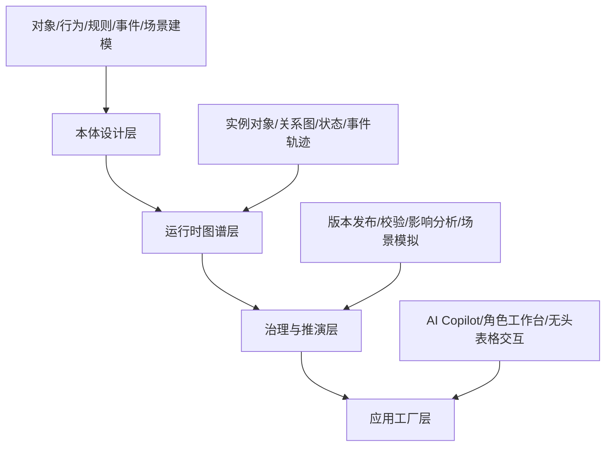

# V1 平台蓝图

## 1. 产品定义

V1 定义为一套面向企业业务架构与业务运营的**业务语义操作系统**。  
它不是单纯的知识图谱工具，也不是传统的低代码表单平台，而是以本体为中心，将业务对象、业务动作、业务约束、业务事件和业务场景统一建模，并驱动业务系统运行。

平台的对外表达采用：

- **Ontology**：定义企业世界如何被描述。
- **Operational App**：让业务人员在真实业务场景中工作。
- **AI Copilot**：把复杂系统交互转换成自然语言和智能追问。

## 2. V1 目标

- 为业务架构师提供一套可治理、可发布、可追溯的本体设计工作台。
- 为 CRM 运营提供一套可配置、可推演、可校验的业务场景装配能力。
- 为业务前台提供一个 AI 原生的 CRM 样板应用，验证本体可驱动交互、规则和闭环。
- 建立一套可复用的方法论，为后续复制到供应链、项目管理、合同管理等领域打底。

## 3. 设计原则

- **本体先于应用**：先沉淀企业语义，再驱动应用生成和业务执行。
- **双层结构**：模型层定义语义与约束，实例层承接运行时事实与关系。
- **对象与行为解耦**：行为不埋在孤立页面逻辑中，而是被独立建模和复用。
- **规则显式化**：规则是独立资产，不再隐藏在代码和流程节点里。
- **事件驱动闭环**：通过事件传播触发规则命中、动作执行和数据回写。
- **场景动态组装**：场景是对象、行为、规则、事件的业务编排，而不是静态流程图。
- **AI 做前台副驾**：AI 负责意图识别、语义补全、解释与提示，不替代底层本体。
- **对中国企业可运营**：强调版本、发布、审计、模板、角色分工和可治理性。

## 4. 能力分层

### 4.1 本体设计层

- 面向业务架构师设计企业领域本体。
- 输出领域模型、依赖关系、规则与事件链。
- 以可发布资产包的方式沉淀到领域模板中心。

### 4.2 运行时图谱层

- 将发布后的模型映射到业务运行时。
- 管理对象实例、关系网络、状态变化、关键事件和动作结果。
- 形成可查询、可追溯、可解释的业务事实图谱。

### 4.3 治理与推演层

- 负责版本、校验、依赖分析、变更影响评估、发布和回滚。
- 按场景模拟业务链路，观察规则命中、事件传播和数据回写路径。

### 4.4 应用工厂层

- 以本体为隐式控制面，生成或装配业务工作台。
- 提供自然语言交互、无头表格/列表、角色工作台和可解释提示。
- V1 聚焦 CRM 样板应用，不做通用平台泛化。

## 5. 核心用户

### 5.1 业务架构师

- 负责抽象领域对象、关系和生命周期。
- 维护行为、规则、事件、场景的标准资产。
- 评估模型变更对业务链路的影响。

### 5.2 CRM 运营

- 把模型资产配置成可执行业务场景。
- 维护阶段门槛、预警阈值、分配规则、审批策略。
- 通过推演中心观察流程瓶颈和规则覆盖情况。

### 5.3 一线销售与销售主管

- 销售通过 AI 与工作台协同，快速录入、推进、查询与协作。
- 主管通过风险预警、跨对象洞察和影响链追踪做干预。

## 6. 产品边界

### V1 纳入

- CRM 样板领域。
- 线索、商机、报价、合同的语义与场景闭环。
- AI 驱动的录入、追问、推进、解释、预警与查询。
- 发布后的实例图谱和操作追溯。

### V1 不纳入

- 通用代码生成平台。
- 发票、回款、售后服务等完整后链路。
- 大范围多行业模板商城。
- 完整 BI、数据仓库和经营分析平台。

## 7. V1 成功标准

- 本体能稳定表达 CRM 样板间的核心业务语义。
- 场景配置不依赖硬编码流程页面，能通过模型装配完成闭环。
- AI 交互能够显著降低前台填表负担，并提升阶段推进质量。
- 每个关键动作都能追溯到模型层的对象、行为、规则、事件和场景。
