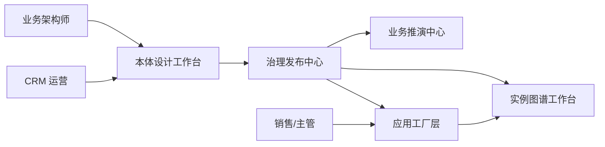

# 模块与运营模型

## 1. 平台模块总览

V1 平台由五个核心模块构成：

1. 本体设计工作台
2. 实例图谱工作台
3. 治理发布中心
4. 业务推演中心
5. 领域资产中心

## 2. 本体设计工作台

### 目标

- 让业务架构师沉淀可复用的领域语义资产。
- 让 CRM 运营在不改代码的前提下组合业务能力。

### 核心能力

- 对象建模：对象、属性、关系、生命周期。
- 行为建模：可执行动作、输入要求、执行结果、回写对象。
- 规则建模：校验规则、风控规则、门槛规则、提示文案。
- 事件建模：触发源、订阅方、传播条件、影响范围。
- 场景建模：把对象、行为、规则、事件装配成业务场景。

### 关键输出

- 领域模型版本包。
- 模型校验结果。
- 依赖关系图。
- 可发布场景定义。

## 3. 实例图谱工作台

### 目标

- 把发布后的模型映射到实际业务运行世界。
- 支撑跨对象查询、状态观察、追溯和 AI 上下文注入。

### 核心能力

- 对象实例管理。
- 关系实例管理。
- 生命周期状态快照。
- 事件轨迹记录。
- 业务动作链追踪。

### 典型价值

- 从合同反查报价、商机、客户和联系人。
- 从预警反查规则、责任人、历史动作和未处理事项。
- 为 AI 生成“完整上下文”，减少大模型猜测。

## 4. 治理发布中心

### 核心能力

- 版本管理。
- 参考完整性校验。
- 依赖影响分析。
- 发布、回滚、审计。
- 模型变更对场景的兼容检查。

### 设计要点

- 任何对象、行为、规则、事件、场景的修改，都需要能追溯到版本与操作者。
- 发布不只是发布模型，还要同步更新场景可执行定义和应用工厂可消费接口。

## 5. 业务推演中心

### 核心能力

- 场景执行模拟。
- 规则命中解释。
- 事件传播可视化。
- 变更前后影响对比。
- 风险链分析。

### 典型场景

- 商机推进到“方案确认”前，检查是否缺失关键联系人和预算信息。
- 报价调整折扣后，推演是否触发审批和风险升级。
- 合同生成前，推演继承字段、客户资质和价格约束是否冲突。

## 6. 领域资产中心

### 核心能力

- 领域模板库。
- 场景模板库。
- 规则模板库。
- 行业复制包。
- 资产复用与引用关系管理。

### V1 要求

- CRM 必须成为第一个标准领域模板。
- 模板需要能复制到新的销售组织或业务单元，并保留版本来源。

## 7. 角色分工模型

### 分工原则

- 业务架构师拥有模型标准定义权。
- CRM 运营拥有场景装配和策略配置权。
- 业务前台不直接接触本体树，而在应用工厂层工作。

## 8. V1 运营闭环

1. 业务架构师定义 CRM 本体和标准规则。
2. CRM 运营将标准资产装配成“线索 -> 商机 -> 报价 -> 合同”场景。
3. 治理发布中心完成校验、发布和版本记录。
4. 应用工厂生成面向销售/主管的工作台和 AI 交互能力。
5. 实例图谱持续记录业务对象、关系、状态和事件。
6. 业务推演中心复盘规则命中、预警链和场景效率。
7. 沉淀出的高价值配置回流领域资产中心，形成可复用模板。
