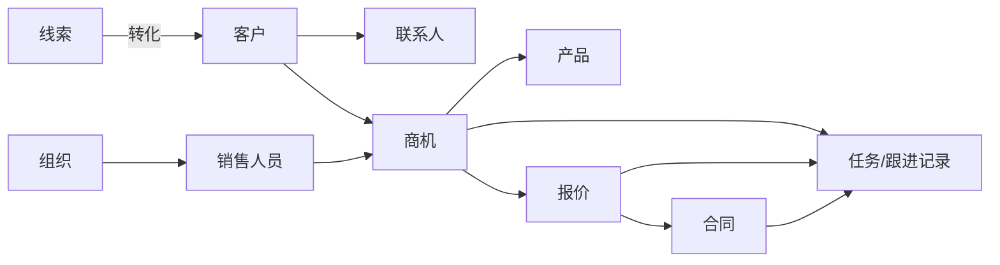
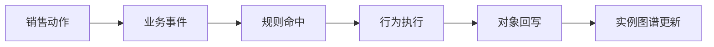

# CRM V1 领域蓝图

## 1. 领域定位

CRM V1 面向 **B2B 项目型销售**，聚焦从线索获取到合同形成的前链路闭环。

V1 不追求“全量 CRM 功能覆盖”，而是重点验证：

- 本体是否能表达销售业务语义。
- 场景是否能由模型驱动，而非由硬编码页面驱动。
- AI 是否能基于本体降低录入成本并提高推进质量。

## 2. 业务边界

### 纳入对象

- 线索
- 客户
- 联系人
- 商机
- 产品
- 报价
- 合同
- 销售人员
- 组织
- 任务/跟进记录

### 暂不纳入

- 发票
- 回款
- 售后服务
- 渠道分销复杂结算
- 全量客服工单体系

## 3. 对象关系总图

## 4. 关键生命周期

### 4.1 线索

- 新建
- 待补全
- 已判定
- 已转客户
- 已作废

### 4.2 商机

- 已创建
- 已资格确认
- 需求确认中
- 方案/报价中
- 商务谈判中
- 赢单
- 输单
- 暂停

### 4.3 报价

- 草稿
- 待校验
- 待审批
- 已批准
- 已作废

### 4.4 合同

- 草稿
- 待法审/风控
- 待签署
- 已签署
- 已失效/作废

## 5. V1 四个主场景

### 场景一：线索录入与补全

- 销售通过自然语言或轻表单录入线索。
- AI 根据本体识别缺失字段，发起追问。
- 满足最低条件后进入线索判定。

### 场景二：线索转商机

- 运营或销售确认客户价值后，将线索转为客户、联系人和商机。
- 转化过程中保留来源追溯关系，不允许脱链。

### 场景三：商机到报价

- 销售推进商机，AI 提示缺失的预算、决策链、竞争态势等要素。
- 达到阶段门槛后才允许生成报价。
- 报价自动继承客户、联系人、产品和价格规则语义。

### 场景四：报价到合同

- 经审批通过的报价生成合同草稿。
- 合同必须保留上游报价与商机引用。
- 合同生成过程触发校验、法审和风险规则。

## 6. 关键规则族

- **完整性规则**：字段齐全、必填关系已建立。
- **阶段门槛规则**：未满足条件不能推进阶段。
- **价格规则**：折扣、毛利、审批权限。
- **合同一致性规则**：合同金额、条款、币种与报价一致。
- **风险预警规则**：长时间未跟进、阶段停滞、异常折扣、关键角色缺失。

## 7. 事件驱动闭环

### 示例

- 新建线索 -> `lead.created`
- 线索信息补全 -> `lead.completed`
- 线索转商机 -> `opportunity.created`
- 商机阶段推进 -> `opportunity.stage.changed`
- 报价生成 -> `quote.generated`
- 报价审批通过 -> `quote.approved`
- 合同创建 -> `contract.created`
- 商机超期未跟进 -> `opportunity.stalled`

## 8. 追溯要求

V1 明确要求以下链路可追溯：

- 合同 -> 报价 -> 商机 -> 客户 -> 联系人
- 任何业务动作 -> 触发行为 -> 命中规则 -> 关联事件 -> 更新对象
- 任何预警 -> 所属对象 -> 责任角色 -> 未完成动作 -> 升级路径

## 9. 面向主管的价值

- 不再只看静态报表，而是看到“卡在哪里、为什么卡、谁该动、动了会影响什么”。
- 主管干预对象不再是单据本身，而是场景中的关键断点和风险链。
