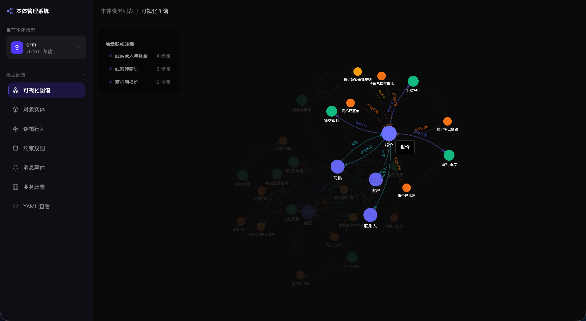
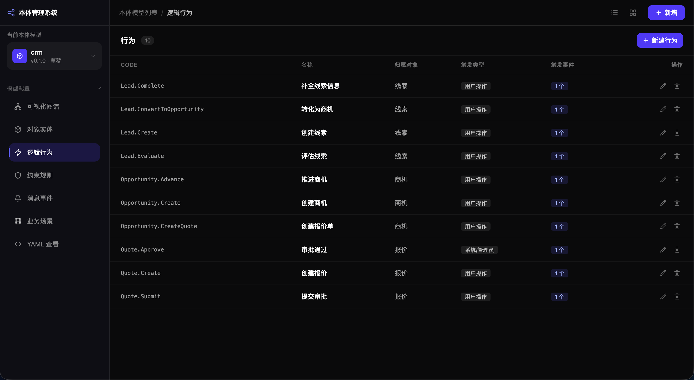
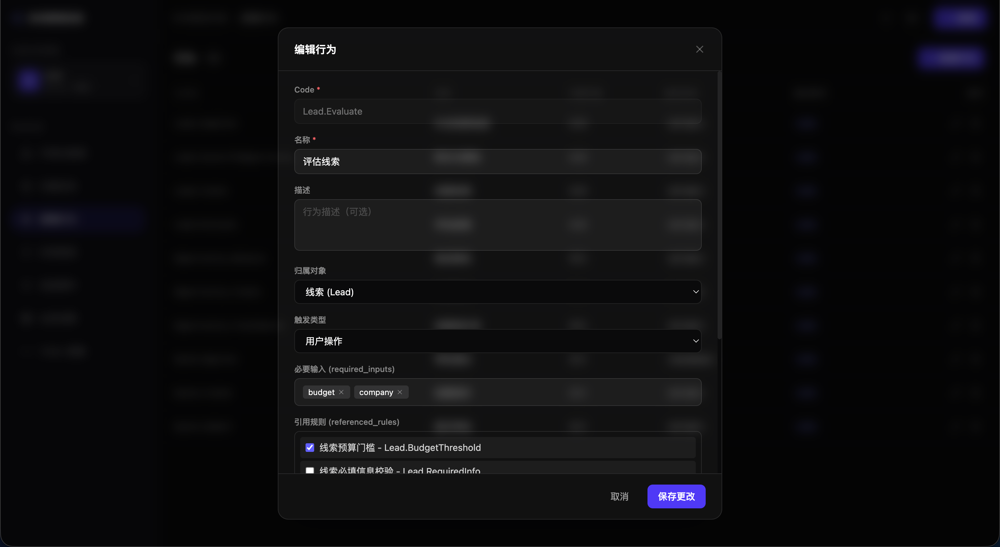
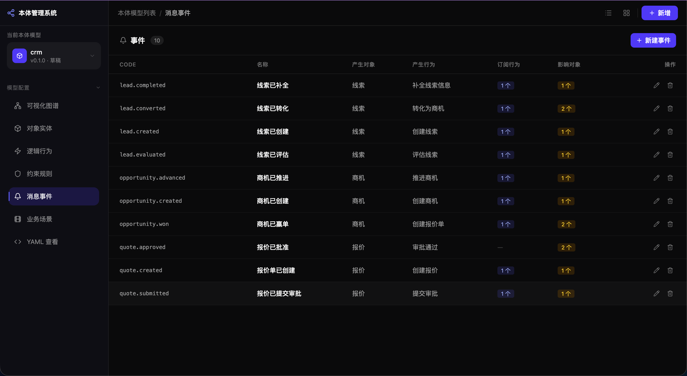
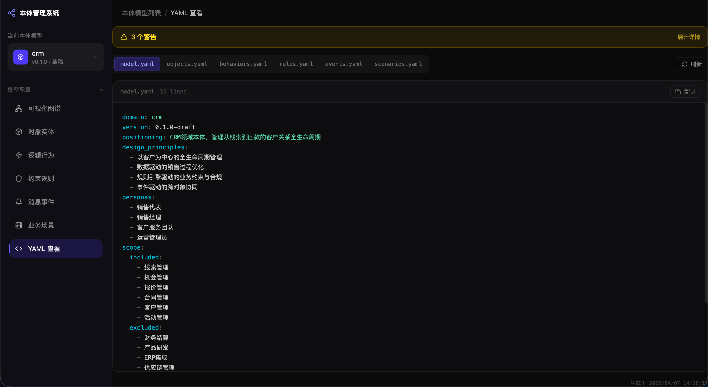
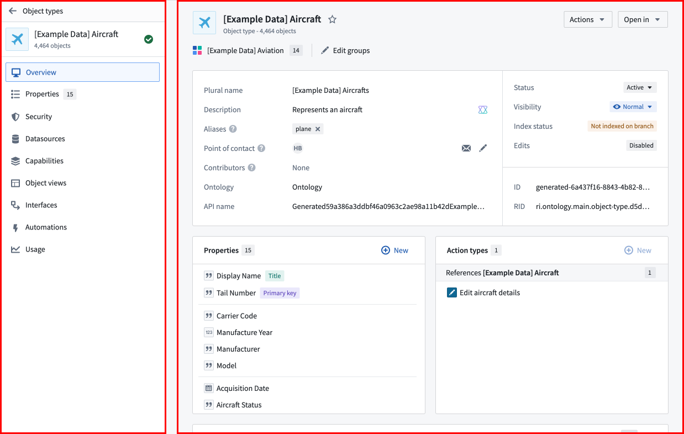

# 本体系统的构建：为什么第一层必须从 CRM 场景里长出来

如果今天让一个销售团队说出他们最痛苦的 CRM 问题，答案通常不会是"系统里少了一个字段"。

他们更常说的是:

线索录进去了，但质量参差不齐，真正能跟进的没几个；商机在系统里看起来状态正常，但推进不动；报价做出来了，却说不清为什么这次折扣可以批、上次不可以；合同生成后，和原始商机、报价之间的关系又经常断掉；主管能看到结果，却看不到过程里的断点、原因和责任人。

这些问题表面上像流程问题、填报问题、执行问题，往深里看，其实是同一个问题:

企业没有一套被系统显式表达出来的业务语义结构。

也正因为如此，我们在这个项目里没有从页面开始做 CRM，而是先做本体系统。因为只有第一层立住了，后面的能力、Agent、编排、对话才有真正可靠的地基。

## 一、为什么 CRM 不能只被做成"几张表"和"几条流程"

在很多系统里，CRM 常常被拆成若干模块: 线索管理、客户管理、商机管理、报价管理、合同管理。

这种拆法当然没有错，但它容易带来一个副作用: 每个模块都成立了，每个页面都能用，可一旦业务跨模块流动，语义就开始断裂。

比如，线索什么时候可以转商机？商机为什么还不能生成报价？报价为什么必须走更高级审批？合同为什么必须继承某些字段，不能手工改掉？这些问题如果没有统一的本体表达，就会被分散到各个页面判断、接口代码、流程节点、审批规则甚至人员经验里。

一旦规则散落，系统就会出现三件事。

第一，业务理解不一致。销售、运营、产品、研发，口中的"商机成熟度""可报价状态""关键联系人"往往不是一个意思。

第二，AI 无法稳定工作。因为它看到的是字段和页面，不是领域语义和约束关系。

第三，追溯能力天然薄弱。你能看到"做了什么"，却很难还原"为什么能做""为什么不能做""影响了谁"。

所以，我们不是先定义一个本体系统，然后找个 CRM 套进去；而是在 CRM 这个场景里看到了这些结构性问题，才被迫把本体系统做出来。

如果再往下追一层，会发现这其实也是一次建模思想的变化。

传统面向对象建模里，对象通常天然带着属性和方法，规则大多埋在方法里。比如合同对象的"保存"方法，里面可能同时混着完整性校验、预算校验、交期校验。这样在单个功能里当然能跑通，但一旦业务跨对象联动、跨场景复用、跨角色协同，系统就会越来越像一团打结的线。

而本体建模做的第一件事，就是把这些纠缠拆开。

- 对象回答"世界里有什么"
- 行为回答"世界里能做什么"
- 规则回答"什么情况下能做、不能做"

先拆，再装，才有后面真正灵活的业务编排。

## 二、本体系统首先要回答的，不是"怎么开发"，而是"企业世界怎么被描述"

在这个项目里，本体层不是知识库，也不是术语表，更不是一堆抽象概念。

它解决的是最基础也最关键的问题: 企业业务中的对象、动作、约束、变化和场景，能不能被结构化、统一地表达出来。

围绕 CRM，我们最终把第一层收敛成五类核心资产。

### 1. 对象

对象回答的是"业务里到底有什么"。

在 CRM 样板间里，我们没有只停留在线索、客户、商机三件套，而是把真正参与前链路闭环的对象都纳入进来: 线索、客户、联系人、商机、产品、报价、合同、销售人员、组织、任务与跟进记录。

更重要的是，每个对象都不只是一个名字，而是同时带着三类东西:

- 关键属性
- 生命周期
- 与其他对象的关系

例如商机不是一条普通记录，它有金额、阶段、预算状态、竞争态势、决策链状态，也有"属于哪个客户、有没有关键联系人、是否已经关联报价、有没有跟进活动"等关系。只有这些都被定义出来，系统才知道一个商机在业务里"是什么"。

可以用一个非常简化的对象定义来理解这种"不是几张表，而是业务对象"的差别:

```yaml
code: Opportunity
name: 商机
lifecycle:
  - 已创建
  - 已资格确认
  - 需求确认中
  - 方案报价中
relations:
  - belongsToCustomer
  - hasPrimaryContact
  - hasQuote
```



### 2. 行为

行为回答的是"这些对象到底能做什么"。

这一步非常关键，因为很多企业系统最大的问题就在于: 动作被埋在按钮里，业务语义被埋在页面逻辑里。

在我们的设计里，录入线索、补全线索、线索转商机、推进商机阶段、生成报价、提交审批、批准报价、由报价生成合同、记录跟进、风险升级，都是独立定义的行为。

这样做的价值是，动作不再属于某个页面，而属于业务本身。页面、API、AI、Agent 都只是这些行为的不同入口。

这正是本体方法和传统 OO 方法最重要的分叉点之一: 行为不再被锁死在对象方法和页面按钮里，而被提升为可复用、可编排、可解释的独立资产。

```yaml
code: Opportunity.GenerateQuote
owner_object: Opportunity
required_inputs:
  - selectedProducts
  - quoteAmount
  - discountRate
referenced_rules:
  - Quote.GenerationEligibility
  - Quote.MarginGuard
emits_events:
  - quote.generated
```



### 3. 规则

规则回答的是"什么情况下允许做，什么情况下不允许做"。

如果没有规则层，系统永远只能停留在 CRUD。因为业务真正复杂的地方，从来不在"能不能改字段"，而在"这个动作在当前上下文下到底合不合法"。

CRM 里最典型的几类规则，在项目里都被显式建模了出来:

- 线索基础信息是否完整
- 线索是否达到可转商机门槛
- 商机推进到下一阶段前，预算和决策链是否齐备
- 最近是否有有效跟进
- 报价折扣和毛利是否越界
- 报价审批权限是否匹配
- 合同是否只能从已批准报价生成
- 合同关键字段是否与来源报价保持一致

一旦规则被显式化，系统就第一次具备了"解释能力"。它不只会说"失败了"，还能说"为什么失败""缺了什么""应该找谁处理"。

这也是为什么规则必须被单独建模。因为同一条规则，往往会被多个行为、多个对象、多个场景反复引用。只有把规则从代码分支和页面校验里抽出来，它才会真正变成企业自己的可复用资产。

```yaml
code: Opportunity.StageGate
type: stage_gate
expression: >
  if targetStage == "方案报价中"
  then budgetStatus == "已确认" and decisionChainStatus == "已识别"
failure_message: 当前商机尚未满足下一阶段门槛
```



### 4. 事件

事件回答的是"业务变化如何在系统中传播"。

企业业务不是静止的对象集合，而是持续变化的状态网络。线索被创建，意味着后续要补全；线索被补全，意味着可以进入转化；商机阶段变化，意味着可能触发报价生成资格判断；报价被批准，意味着合同可以创建。

如果没有事件层，系统只能靠硬编码流程去串联动作；有了事件层，对象、行为和规则之间才能真正解耦。

这也是为什么在我们的 CRM 设计里，会有 `lead.created`、`lead.completed`、`opportunity.stage.changed`、`quote.generated`、`quote.approved`、`contract.created` 这类事件。它们不是日志，而是业务世界中的"状态变化事实"。

从方法论上说，事件层非常关键，因为它把系统从"正向录入一次就结束"推进到"发生一个事实后，还能继续触发后续闭环"。

可以把它理解成一个逆向闭环:

事件 -> 规则 -> 行为 -> 回写 -> 数据更新

也就是说，本体系统真正想做的，不只是把业务对象描述出来，而是让业务世界在变化时，能够沿着显式语义自动传导、自动解释、自动回写。

```yaml
code: quote.approved
producer_behavior: Quote.Approve
subscribers:
  - Quote.GenerateContract
impacted_objects:
  - Quote
  - Contract
```



### 5. 场景

场景回答的是"这些对象、行为、规则、事件，最后如何组合成一个完整的业务闭环"。

对企业来说，真正重要的从来不是单个对象，而是业务目标能不能完成。比如"把线索补全到可判定状态""从线索生成客户、联系人和商机""在满足门槛后生成可审批报价""从已批准报价生成保持追溯关系的合同"。

所以场景层的价值，在于把离散的资产装配成业务可执行链路。

从线索录入与补全，到线索转商机，到商机到报价，再到报价到合同，这条主链路在项目里都已经被定义成可装配、可校验、可推演的场景。

这一点也特别重要。场景不是画死的流程图，而是对象、行为、规则、事件在某个业务目标下的一次装配结果。正因为如此，底层资产不变时，场景就可以按组织、角色、策略版本做动态组合，而不用每次都重写一遍系统逻辑。

这里还需要特别澄清一个容易混淆的点: 我们说的本体系统，并不等于传统意义上的一套 OWL 式知识图谱定义。

它当然吸收了知识图谱的思想，比如对象之间有关系、整个模型天然形成知识网络；但它更进一步，把行为、规则、事件、场景都提升成了一等公民。换句话说，它不是只回答"概念如何被分类和关联"，而是还要回答"业务如何被执行、变化如何传播、规则如何复用、场景如何装配、数据如何被反向驱动"。

这也是为什么它更像一个面向业务闭环的语义操作模型，而不只是一个概念字典或静态图谱。

如果引入 Palantir 作为一个外部参照，这个差异会更容易理解。Palantir 的 Ontology 材料里，通常会把 `Object Type`、`Link Type`、`Action Type`、`Function / Interface` 作为核心元素来理解。其中最值得注意的，不是"对象之间有关联"这件事，而是 `Action Type` 让图谱从"可看"走向"可操作"，`Function` 让语义层能够承载派生计算，而 `Operational App / Workshop` 这样的前台，又是直接消费这些语义资产的。也就是说，本体不是孤立的建模结果，而是后续运行时应用和受控动作的源头。

我们当前这套系统和它并不完全相同，但在方向上有一个明显共鸣: 本体如果不能进入动作、解释、治理和应用消费链路，就很容易退化成一套漂亮但离业务很远的模型说明书。

```yaml
scenario: quote_to_contract
steps:
  - behavior: Quote.Approve
  - event: quote.approved
  - behavior: Quote.GenerateContract
success_criteria:
  - Contract 创建成功
  - Contract 与 Quote 保持追溯关系
```



## 三、为什么第一层一定要设计成这五类，而不是更简单一点

因为 CRM 已经把"更简单一点"的方案证明过不够用了。

如果只有对象，没有行为，系统就会重新退化成数据字典。

如果只有对象和行为，没有规则，系统就只能描述"可以做什么"，却无法判断"现在能不能做"。

如果没有事件，跨对象协同就只能重新写回流程和代码里。

如果没有场景，业务就还是会碎在单个模块里，无法形成完整闭环。

也就是说，这五类资产不是为了显得完整，而是 CRM 这个真实业务场景一层层逼出来的最小闭环结构。

再换一句更直白的话说:

如果没有对象，我们不知道系统在处理什么。

如果没有行为，我们不知道系统能做什么。

如果没有规则，我们不知道系统此刻为什么能做、为什么不能做。

如果没有事件，我们不知道变化如何传播。

如果没有场景，我们不知道这些能力如何围绕业务目标被真正组织起来。

## 四、本体系统不是一套文档，而是一台"语义生产机器"

在这个项目里，本体系统已经不是停留在概念设计上，而是被做成了一个可操作的工作台。

它至少具备了几类非常关键的系统能力。

第一，可视化组织能力。系统把本体拆成可视化图谱、对象实体、逻辑行为、约束规则、消息事件、业务场景、YAML 查看七个工作区，让建模不再是一堆零散文档，而是一套可以被编辑、浏览、检查的结构化界面。

第二，引用完整性校验。对象删不掉，不是因为按钮没做好，而是因为它可能正被行为、规则、事件、场景或其他对象引用。系统会显式检查这些依赖关系，避免模型在演进中悄悄断裂。

第三，结构化装配输出。对象、行为、规则、事件、场景最终会被装配成 `model.yaml`、`objects.yaml`、`behaviors.yaml`、`rules.yaml`、`events.yaml`、`scenarios.yaml` 这组六件套。也就是说，本体不是只给人看，还要变成后续能力层、应用工厂、AI 交互可以消费的结构化契约。

这里也可以借 Palantir 的一个思路来反看我们自己: 语义层不是再存一份业务数据，而是作为"对象定义 + 映射关系 + 可执行动作 + 派生逻辑"的控制层存在。换句话说，真正需要被稳定管理的，不是又一份业务副本，而是业务世界该如何被解释、如何被操作、如何被前台应用消费。

第四，面向 AI 的语义增强方向。系统类型定义已经开始支持更丰富的属性 schema、关系语义、行为输入输出、规则结构化表达、事件 payload、场景决策点等内容，这意味着它不是停留在"人能看懂"，而是在向"AI 能稳定理解和执行"继续推进。

第五，可视化知识网络能力。本体不是一棵死树，而是一个有双向引用关系的知识网络。对象会连到行为，行为会引用规则，行为会触发事件，事件又会回到其他对象和场景。也正因为如此，本体系统天然适合做成图谱视图、依赖分析和场景模拟，而不只是一个 YAML 编辑器。

这也是为什么 Palantir 式产品会特别强调图谱可视化、动态推演和治理发布。真正值得借鉴的，不是"做一张很炫的关系图"，而是承认业务语义一旦进入生产使用，就一定要配套依赖分析、版本边界、发布审计和 What-if 式推演能力。否则模型越重要，系统反而越脆弱。

## 五、理论不是停在 PPT 上，而是已经被做成了一个可操作系统

如果只讲到"对象、行为、规则、事件、场景"五类资产，这篇文章仍然很容易被误读成一套漂亮的理论。

但这个项目真正重要的地方在于，我们已经开始把这些抽象概念做成一个可以实际操作、校验、导出和演进的本体系统。

### 1. 它已经被实现成一个分工作区的本体工作台

当前系统不是一页大表单，而是拆成了多个明确工作区: 可视化图谱、对象实体、逻辑行为、约束规则、消息事件、业务场景、YAML 查看。

这种结构背后的含义非常强。它说明本体系统不是把所有内容揉成一个"配置中心"，而是承认对象、行为、规则、事件、场景本来就是不同性质的资产，需要在不同视角下被设计和审查。

这也和前面的理论是一致的。对象工作区回答"世界里有什么"，行为工作区回答"世界里能做什么"，规则工作区回答"什么条件下才能做"，事件工作区回答"变化如何传播"，场景工作区回答"这些资产如何被装配成业务闭环"。

### 2. 它已经具备了模型治理能力，而不是只会让你录定义

一个真正可用的本体系统，不能只是让人随便录对象、随便删规则。否则模型很快就会碎掉。

所以当前实现里，本体系统已经开始做两件非常关键的治理工作。

第一，引用完整性校验。对象如果正被行为、规则、事件、场景或其他对象引用，就不能被轻易删除。也就是说，系统知道"删掉一个点，会不会把整张语义网撕裂"。

第二，整体一致性校验。系统会检查行为引用的规则和事件是否存在，规则关联的对象和行为是否存在，事件的生产者和订阅者是否闭合，场景中的步骤是否能指向真实资产。这样，本体第一次拥有了类似"编译检查"的能力。

这背后其实是一个很重要的观念变化: 本体不是文档，模型也不是备注，而是需要被校验、被发布、被治理的生产资产。

```ts
if (!behaviorCodes.has(event.producer_behavior)) {
  issues.push("producer_behavior not found");
}
```

这段极简伪代码想表达的其实很简单: 模型不是"随便填一填就行"，它和代码一样，需要基本的引用完整性检查。

### 3. 它已经能把模型装配成结构化语义契约

在这套系统里，对象、行为、规则、事件、场景最后并不是散落地存着，而是会被装配成 `model.yaml`、`objects.yaml`、`behaviors.yaml`、`rules.yaml`、`events.yaml`、`scenarios.yaml` 六类结构化文件。

这个细节非常关键。因为这意味着本体系统不只是一个"编辑器"，还是一个"语义装配器"。

装配后的 YAML，不只是给人阅读，更是给后续能力层、应用工厂、AI 交互、Skill 生成器消费的契约。也就是说，本体层输出的不是一篇说明书，而是一组可被程序和 Agent 稳定消费的语义源文件。

如果对照 Palantir 的思路去看，这也很像它把对象定义、动作定义、派生计算和应用消费关系放在一套统一语义层里管理的做法。差别只在于，我们现在采用的是更贴近自己工程实际的 YAML 与工作台方式，而不是完全复刻其产品形态。

这也是为什么文档里会强调 YAML 很重要。因为对本体层来说，结构比叙述更重要；而对 AI 来说，结构化语义契约远比一堆散文式说明更稳定。

```yaml
model: model.yaml
objects: objects.yaml
behaviors: behaviors.yaml
rules: rules.yaml
events: events.yaml
scenarios: scenarios.yaml
```

### 4. 它已经开始把模型树变成知识图谱和场景模拟器

在理论上，我们一直说"本体不是树，而是网络"。而当前系统已经开始把这句话落成可视化能力。

可视化图谱工作区会把对象、行为、规则、事件、场景转成不同类别的节点，再通过引用关系把它们连成一个动态网络。这样用户看到的不再是孤立的配置项，而是一个完整的业务知识结构。

更进一步，系统还支持围绕场景做步骤级模拟。也就是说，它不只是告诉你"有哪些资产"，还开始告诉你"这些资产在一个业务场景里会如何被依次触发"。这使本体从静态设计进一步走向了动态理解。

这件事的价值很大。因为很多人只有在看到图谱和模拟时，才会真正理解本体系统为什么不是简单的模型树，而是一个可以表达依赖、传播和闭环的知识网络。

这也是 Palantir 相关材料反复提醒的一点: 图谱展示本身不是目的，真正的重点是用户能否从任意对象节点出发，沿着关系、动作和推演结果继续工作。也就是说，图不是最终产品，图只是让语义系统进入运营现场的一种观察面。



### 5. 它已经在朝"AI 可理解的本体"继续演进

从理论上说，本体系统如果只解决"人能看懂"，其实还不够。因为这个项目最终要服务的，不只是架构师和产品经理，还有能力层、Agent、编排层和对话层。

所以当前实现里，类型系统已经开始向更丰富的语义契约推进，比如:

- 对象属性不只记录名字，还会带类型、是否必填、枚举、示例、别名和校验约束
- 关系不只记录目标对象，还会表达基数、所有权、级联删除、逆向关系
- 行为不只记录 required inputs，还会朝输入 schema、前置条件、结果 schema、后置影响演进
- 规则不只是一串表达式，还在向结构化表达、输入上下文、下一步建议发展
- 事件不只是名字和订阅者，还在向 payload、传播条件、trace policy 推进
- 场景不只是步骤列表，还在向决策点、回滚、观测指标演进

这一层很重要，因为它决定了本体能不能从"人类业务建模工具"，继续长成"AI 原生应用平台的真正语义底座"。

## 六、本体系统到底解决了什么问题

如果只用一句话概括，本体系统解决的是: 让企业业务第一次拥有了一个统一、显式、可执行、可追溯的语义底座。

拆开来说，它至少解决了五类问题。

第一，解决语言不统一的问题。业务、产品、研发、AI 不再各说各话，而是围绕同一套对象和规则工作。

第二，解决跨对象断链的问题。线索、客户、联系人、商机、报价、合同之间不再只是"能跳转"，而是有明确继承和追溯关系。

第三，解决规则隐藏的问题。门槛、审批、风险、完整性要求不再散落在页面和流程里，而成为显式资产。

第四，解决 AI 没法可靠落地的问题。AI 不再只能围着表单打转，而是能基于明确的业务对象、规则和事件来理解上下文、解释限制、执行动作。

第五，解决流程僵硬的问题。前台体验可以是柔性的对话、追问和推荐动作，但后台仍然有刚性的阶段门槛、审批边界和状态约束。这样用户感受到的是"被辅导"，而不是"被卡死"。

第六，解决复制扩展的问题。当 CRM 这套方法跑通之后，后续复制到其他业务域时，复用的就不再是页面，而是建模方法和语义资产。

## 结语

为什么本体系统一定是第一层？

因为企业业务里最难、也最不能跳过的，从来不是把界面做出来，而是先把"这个世界究竟是什么、能做什么、在什么约束下变化、如何形成闭环"讲清楚。

CRM 正好把这件事暴露得非常彻底。它让我们看到，企业系统如果没有本体层，就只能在字段、流程、页面和经验之间来回缝补；而一旦本体层建立起来，后面的能力层、Agent 层、编排层、对话层，才真正有了可以站住的地基。

所以，本体系统并不是这个项目里最"炫"的部分，却很可能是最决定长期价值的部分。

因为它定义的不是一个页面怎么工作，而是整个业务世界，如何第一次被系统真正理解。

而一旦这件事成立，系统就不再只是记录业务的地方，它会开始成为推动业务、解释业务、沉淀业务的地方。

参考
https://www.palantir.com/docs/zh/foundry/ontology-manager/overview